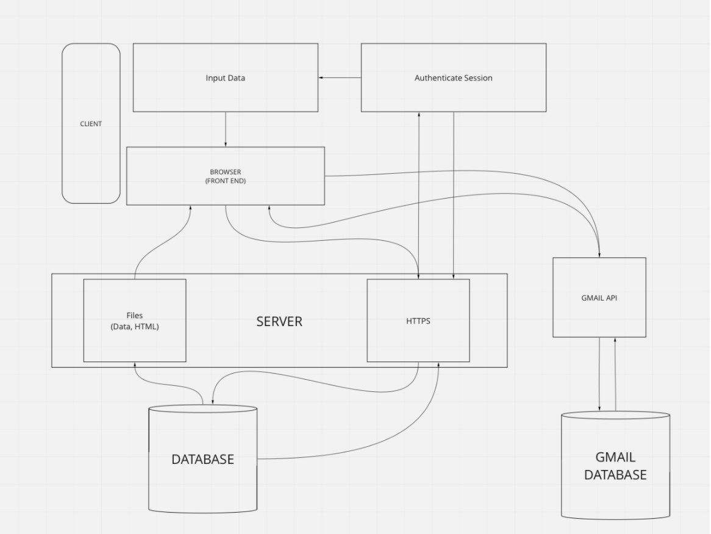
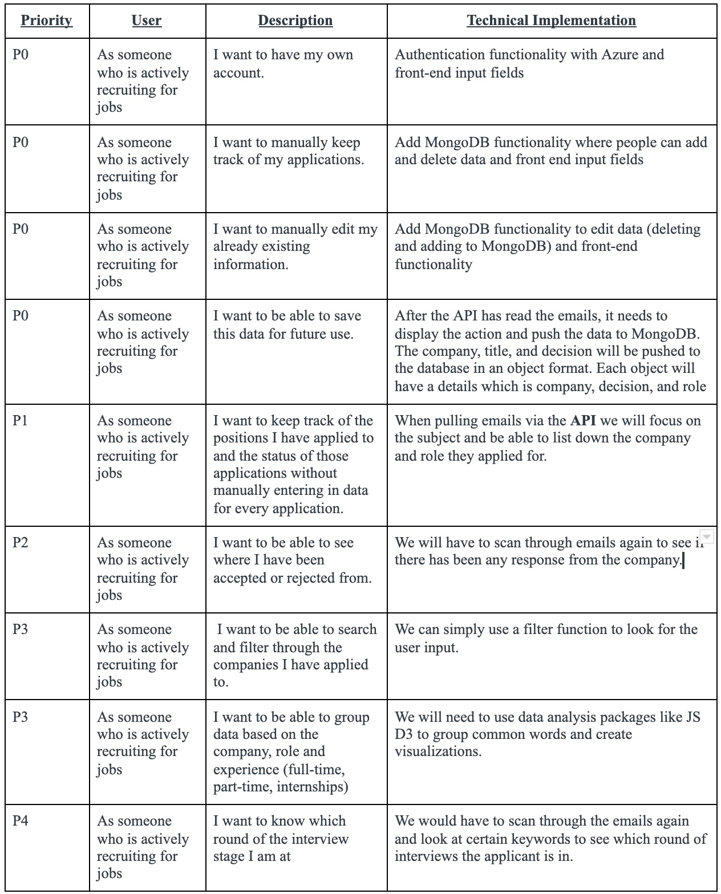

**Job-Tracker**

**Functionality for Gmail API:**
https://washington.zoom.us/rec/share/dpLEvmnboPpdpx7UphRs0mtAQEuuH3WgkEHca1i6GDXesirNa6f1TuetHD0J8g.-w_5t_07LxXY9fu5

**Proposal**

The application that we plan to develop is a Personal Job Tracking System. The purpose of this application is because there are various websites that an applicant applies to and sometimes loses touch on what companies they have applied to. The tool being devised will track your email for application messages and go through an intensive analytical process to show how your recruiting process has been performing.

**Project Description:**

The target audience is anyone trying to find a job and has been applying with their given email address. More specifically, this is very useful for graduating students and users looking for jobs and want to keep track of their application process. Having an organized process makes it easier to react to your own application and lets the individual know where they need to focus on.
College Graduating Students is a major demographic that we plant to target. We can speak of it personally as we are currently applying to companies and lose track of what role and company we have sent this to. Moreover, there are times when we do not hear back from companies and need to reach out again, and so this application would be able to let us know that the user needs to take some action. The user domain will also be able to analyze if something is incorrect with his Resume that is not landing his dream job but is strong in another role.
Our audience will want to use our application because it helps with the job search. At this moment, people often simply apply to jobs and forget about it. Our application would go through their emails to find when they have applied and scan to see whether they have been invited for an interview or rejected. As students currently applying for jobs, we would love to have an automated system that tracks jobs for us too.
As developers, we want to build this application because we want experience using different API’s and in this case we would be using the Gmail API. We have also been using an app called Shop that goes through all your emails to find all the packages that you have ordered, retrieves the tracking information, and gives you real time data about where the package is. We found this application extremely interesting and useful and want to learn how to create something similar.

**Architecture Diagram:**

**Technical Description:**

**Endpoints:**

GET /{userid}/jobs
This will get all the jobs from the mongoDB database
The use case for this is getting inputted data, first simply from MongoDb and then from Gmail

POST /{userid}/jobs
This will send the data to the database after the user
This will be when we do our P0 because the user will have to manually enter data

**Resources:**
https://developers.google.com/gmail/api
https://www.youtube.com/watch?v=GHXT59krs5E&ab_channel=OpenSourceAutomation-AfsarAli
